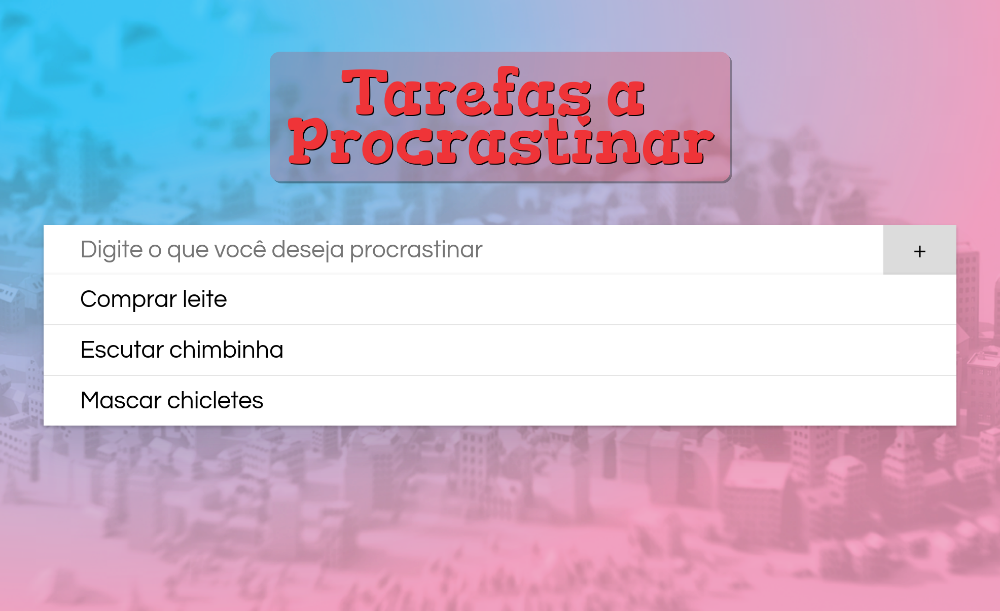
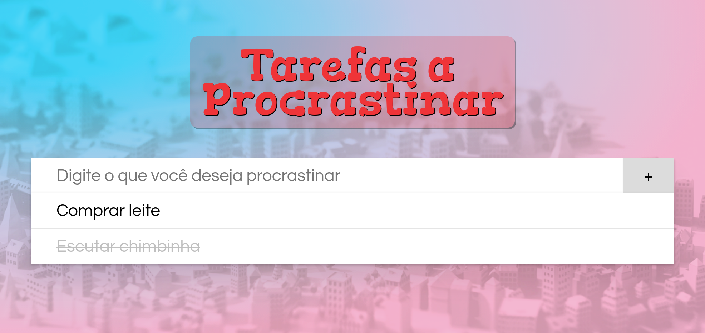

# Lista de Tarefas para Procrastinar :notebook:

Gerencie aquelas tarefas que você quer ~~não~~ fazer.



## Atividade

Você deve fazer um sistema para cadastrar novas atividades que você ~~não~~
quer fazer. Fazendo isso, você vai treinar usar objetos em JavaScript e
criar elementos HTML dinamicamente.


### Exercício 1: Carregar **tarefas existentes**

No arquivo `tarefas.js` existe um vetor `tarefas` em que cada objeto
representa uma tarefa. Ele já possui duas tarefas: "Comprar leite" e
"Escutar chimbinha".

Neste exercício, você deve criar uma função `insereTarefaNaPagina` (no
singular) que, recebe por parâmetro **01 objeto** com uma tarefa e
insere 01 elemento HTML `<li>` na lista de tarefas
(_i.e._, `ul#lista-tarefas`). Veja o FAQ sobre como inserir elementos HTML
dinamicamente na página. Ele **deve ser inserido ao final**.

O `<li>` que representa a tarefa deve ter uma classe `item-tarefa` para
que ele seja devidamente estilizado. Se a tarefa está `marcado` como
`true`, você deve colocar a classe `marcado` no
`<li class="item-tarefa">...</li>`, além da `item-tarefa`.

Depois de criar a função, **chame-a para cada objeto que está no vetor
`tarefas`**. Logo antes de popular o elemento HTML da lista com as tarefas,
não se esqueça de remover todos os filhos que estiverem lá.

Resultado parcial:



### Exercício 2: Incluir uma nova tarefa

Quando o usuário clicar no botão `#incluir-nova-tarefa`, (a) crie um
novo objeto representando a nova tarefa (veja no FAQ), (b) coloque-a ao
final do vetor `tarefas` (veja no FAQ) e, então, (c) chame a função que
`insereTarefaNaPagina` passando o objeto da nova tarefa como argumento.

O `nome` da tarefa é o que o usuário digitou no campo, a `categoria` padrão é
a `'outros'`, a propriedade `marcado` deve ser `false`.

Ao final dessa função, você deve **limpar o campo** onde o usuário digitou
a tarefa (_i.e._, `nova-tarefa-nome`).

Opcionalmente, você pode **"devolver o foco"** para esse mesmo controle.
Isso é uma boa prática de Usabilidade que torna a página mais agradável quando
o usuário vai digitar mais que 1 tarefa - assim que ele inclui uma, ele
já está pronto para digitar a próxima.

Todo elemento HTML que pode "ter o foco" tem um método `focus()` que
podemos chamar assim:

```js
// pede o elemento para "roubar o foco" - mover o cursor para dentro dele
elemento.focus();
```

Resultado parcial:


### Desafio 1: Mostrar as novas tarefas no início da lista

Em vez de inserir novos itens por último, insira-os no topo da `ul#lista-tarefas`.
Para isso, lembre-se dos 3 métodos para vincular novos elementos HTML
na página e escolha o apropriado:

1. `containerEl.appendChild`
1. `containerEl.insertBefore`
1. `containerEl.replaceChild`


### Desafio 2: Pressionar "Enter" inclui a tarefa

Além do clique no botão, faça com que o pressionar da tecla "Enter",
quando o foco estiver no campo de texto (_i.e._, `nova-tarefa-nome`), também
insira a nova tarefa no vetor e na página.

Para isso, você pode usar o evento _keyup_ do controle e, dentro da _callback_,
perguntar qual `e.key` foi pressionada. Se `e.key === 'Enter'`, você pode
chamar a mesma função que registrou para o clique do botão - se você usou
uma função definida de forma anônima e _inline_ ¹, agora é uma boa hora para
movê-la para fora e dar-lhe um nome².

¹ função anônima e _inline_:
```js
botaoEl.addEventListener('click', function(e) {
  // ... esta função é inline e não possui um nome
});
```

² função com nome:
```js
function novaTarefa(e) {
  // esta função pode ser chamada em mais de um lugar,
  // porque ela tem um nome e foi definida "no arquivo"
}

botaoEl.addEventListener('click', incluiTarefaNaPagina);
```

### Desafio 3: Escolher a categoria da tarefa

Cada tarefa pode ter uma categoria associada. Descomente o código HTML do
desafio 3 e escreva código JavaScript que permita que o usuário escolha qual a
categoria da nova tarefa.

Quando for incluir o elemento HTML dessa nova tarefa, coloque no
`<li class="item-tarefa">` uma outra classe CSS com o nome `categoria-NOME`,
em que NOME pode ser `lazer`, `compras` ou `estudos` (para as
quais já existem regras CSS de estilização).


## FAQ

1. Como posso criar novos elementos HTML na página?
   - Conforme vimos nos [slides da aula js4][criando-elementos-dinamicamente],
     usamos `let novoEl = document.createElement(qualTag)`, configuramos o
     elemento (colocamos classes, atributos, `innerHTML` etc.) e o vinculamos
     à árvore de elementos da página, com `containerEl.appendChild`,
     `containerEl.insertBefore` ou `containerEl.replaceChild` (este, menos
     usual).
1. Como posso criar um objeto?
   - Existe a (a) forma literal e (b) usando o operador `new`, conforme
     vimos nos [slides da aula js4][criando-objetos].
     ```js
     // forma literal
     let novoLivro = {
       titulo: 'O Pistoleiro',
       autor: 'Stephen King'
     };
     // usando operador 'new'
     let novoCarro = new Object();
     novoCarro.nome = 'Ka';
     novoCarro.marca = 'Ford';
     ```
1. Como inserir um elemento ao final de um vetor?
   ```js
   let frutas = ['laranja', 'maçã'];
   frutas.push('kiwi');
   console.log(frutas);
   // laranja, maçã, kiwi
   ```
   - Veja os [slides da aula js2][array-push]
1. Como colocar/tirar uma classe em um elemento HTML?
   ```js
   ovelhaEl.classList.add('raca-de-ovelha');
   ovelhaEl.classList.remove('raca-de-ovelha');
   ovelhaEl.classList.toggle('invisivel');
   ```
   - Veja os [slides da aula js2][classes]
1. Como fazer algo quando um botão é clicado?
   ```js
   let botaoEl = document.querySelector('button');

   function fazAlgumaCoisa() {

   }

   botaoEl.addEventListener('click', fazAlgumaCoisa);
   ```
[criando-elementos-dinamicamente]: https://fegemo.github.io/cefet-front-end/classes/js4/#criando-elementos-html-dinamicamente
[criando-objetos]: https://fegemo.github.io/cefet-front-end/classes/js4/#usando-objetos-em-javascript
[array-push]: https://fegemo.github.io/cefet-front-end/classes/js2/#metodos-de-arrays
[classes]: https://fegemo.github.io/cefet-front-end/classes/js2/#colocando-removendo-classes
