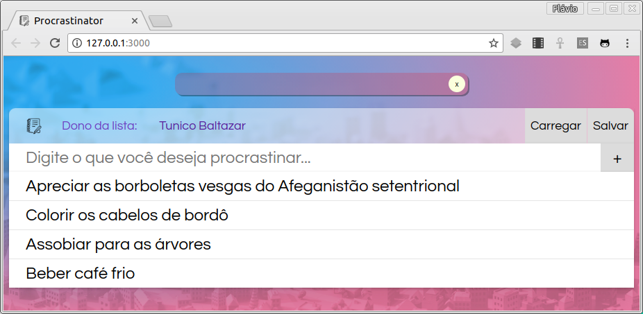
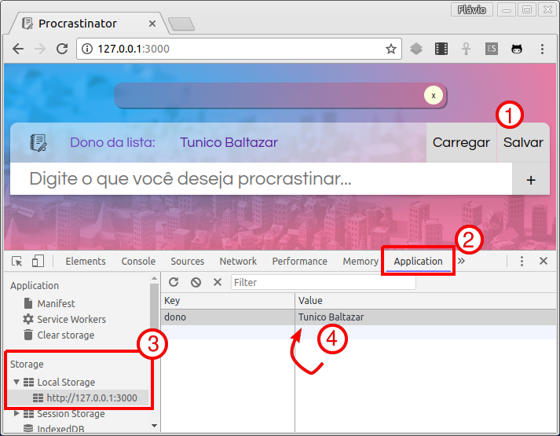
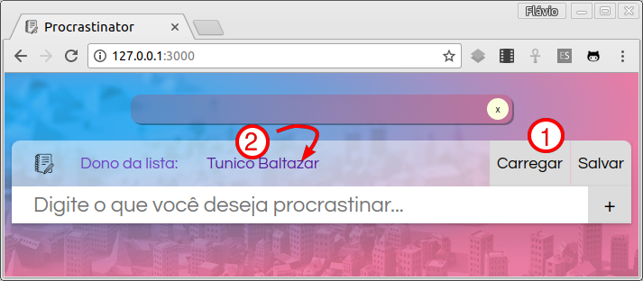
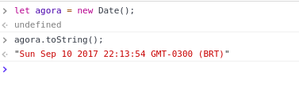
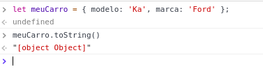
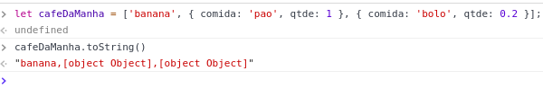

# Lista de Tarefas para Procrastinar x2 :notebook:

Armazene e recupere as tarefas que você quer ~~não~~ fazer.



## Atividade

Vamos continuar a atividade da lista de tarefas :notebook: mas, desta vez,
nosso objetivo é exercitar o uso do WebStorage para salvar e carregar
informações na página.

### ~~Exercício 1: Carregar tarefas existentes~~

Já foi feito :3.


### ~~Exercício 2: Incluir uma nova tarefa~~

Já foi feito :3.


### ~~Desafio 1: Incluir tarefas no topo~~

Já foi feito :3.


### Exercício 3: Salvar e carregar o nome do dono da lista

A página agora possui um novo _input_ `#nome-usuario` e dois novos botões,
`#salvar` e `#carregar`.

Faça com que, quando o usuário clicar em `#salvar`, a página armazene no
_localStorage_ o nome do dono da lista de tarefas (digitado no campo
`#nome-usuario`). Se precisar, veja o FAQ sobre o Web Storage.

Use a ferramenta do desenvolvedor, na guia _Application_, para verificar
o que está salvo no _localStorage_, para ver se funcionou. Veja um exemplo:



Além de implementar o botão para salvar, faça também o botão `#carregar` que,
quando clicado, pega o nome do usuário dono da lista de tarefas e o coloca
no campo `#nome-usuario`.

Resultado parcial:



### Exercício 4: **Tentar** salvar a lista de tarefas

Agora, na mesma _callback_ de `click` do botão `#salvar`, você deve salvar
também, no _localStorage_, o vetor `tarefas`.

Antes de partir para `#carregar` o vetor de `tarefas`, **abra a ferramenta
do desenvolvedor e veja o que foi salvo lá**. É o que você esperava?

Para entender o que aconteceu e corrigir esse problema,
[volte para os _slides_ e continue a aula][formato-de-armazenamento].


### Exercício 5: Salvar e carregar a lista de tarefas

Agora que você sabe o que aconteceu e o que é JSON, use `JSON.stringify` para
salvar o vetor `tarefas` no formato JSON e `JSON.parse` para transformar a
_String_ que foi recuperada do _localStorage_ de volta em um vetor.

Lembre-se de que, ao carregar as tarefas, você deve limpar (remover todo
o conteúdo) o elemento `ul#lista-tarefas`.

Por fim, **remova as duas tarefas de exemplo** do arquivo `tarefas.js`,
tornando o vetor `tarefas` inicialmente vazio:
```js
let tarefas = [];
```

Resultado parcial:


### Desafio 1: Manter a logomarca aberta ou minimizada

Vamos fazer o botão `#minimizar` (aquele com um `x` lá no título) funcionar e,
além disso, persistir seu estado - se a logomarca estiver minimizada e o
usuário atualizar a página, ela deve permanecer minimizada. Se ela estiver
aberta, assim ela deve permanecer. Até que o usuário clique para minimizar ou
abrir novamente.

Para minimizar o título (`#marca`), basta colocar a classe `.minimizado` nele,
ou tirá-la para que ele fique aberto.

Desta vez, em vez de salvar essa preferência (`minimizado`: `true` ou `false`)
para sempre (isto é, no _localStorage_), se o usuário fechar o navegador
e abrir a página novamente (em uma nova sessão, logo, vamos usar
o _sessionStorage_), ele deve ver a logomarca aberta. Para tanto, assim que a
página carregar, devemos olhar para o _sessionStorage_ para saber se devemos
incluir a classe `.minimizado` na `#marca` ou não.


## FAQ

1. Qual a diferença entre **Web Storage**, `localStorage` e `sessionStorage`?
   - **Web Storage** é o nome da tecnologia de armazenamento de dados que uma página Web pode pedir ao navegador para usar
     - Há dois tipos de armazenamento:
       - O `localStorage`, que dura para sempre (veja [os slides][local-storage]); e
       - O `sessionStorage`, que tem a duração da "sessão" ([veja os slides][session-storage])
         - Por exemplo, os dados são mantidos apenas até o usuário fechar o navegador
1. Como posso salvar algo no `localStorage` ou no `sessionStorage`?
   ```js
   localStorage.setItem('nome-do-que-estou-guardando', 'o-que-estou-realmente-armazenando');
   sessionStorage.setItem('nome-do-que-estou-guardando', 'o-que-estou-realmente-armazenando');
   ```
1. Como posso recuperar algo que coloquei no `localStorage` ou no `sessionStorage`?
   ```js
   let valorGuardado1 = localStorage.getItem('nome-do-que-guardei');
   let valorGuardado2 = sessionStorage.getItem('nome-do-que-guardei');
   ```
   - Lembre-se: tudo é armazenado e recuperado como _String_
1. O que é esse `[object Object]`?
   - Se o navegador tenta transformar um _Object_ em uma _String_ - por exemplo, se mandamos salvar um objeto no `localStorage`, o navegador invoca um método que todo objeto possui chamado `.toString()`
   - O `objeto.toString()` é um método que tenta representar o objeto no formato de uma _String_. Por exemplo, se o objeto for uma `Date`, ele vai retornar uma _String_ com a data atual:

     
   - Contudo, para objetos "genéricos", o método `objeto.toString()` retorna sempre `"[object Object]"`:

     
   - Em vetores, quando chamamos `vetor.toString()`, o navegador chama o `toString` para cada item:

    
1. Como posso guardar um objeto no `localStorage`/`sessionStorage` de forma que eu consiga recuperá-lo depois?
   - Veja os slides da aula sobre [como representar objetos em strings][representando-objetos-em-strings] e sobre [o formato JSON][o-formato-json]
   - Conseguimos salvar/recuperar apenas _Strings_ com o Web Storage
   - Contudo, é possível representar um objeto usando uma _String_
     - Basta termos um formato para codificar as propriedades do objeto
   - Para isso, usamos o formato JSON
     - Para salvar, usamos `JSON.stringify(objeto)`, que retorna uma _String_
       ```js
       let meuCafe = { nome: 'pão', qtde: 1 };
       let meuCafeEmString = JSON.stringify(meuCafe);

       // agora, salvamos a 'meuCafeEmString' no localStorage
       localStorage.setItem('cafe', meuCafeEmString);
       ```
     - Para recuperar, usamos `JSON.parse(umaString)`, que retorna o objeto:
       ```js
       let oQueComerString = localStorage.getItem('cafe');
       let oQueComer = JSON.parse(oQueComerString);

       console.log(oQueComer.nome); // imprime 'pão'
       ```

1. Como colocar/tirar uma classe em um elemento HTML?
   ```js
   ovelhaEl.classList.add('raca-de-ovelha');
   ovelhaEl.classList.remove('raca-de-ovelha');
   ovelhaEl.classList.toggle('invisivel');
   ```
   - Veja os [slides da aula js2][classes]

[local-storage]: https://fegemo.github.io/cefet-front-end/classes/js5/#local-storage
[session-storage]: https://fegemo.github.io/cefet-front-end/classes/js5/#session-storage
[formato-de-armazenamento]: https://fegemo.github.io/cefet-front-end/classes/js5/#formato-de-armazenamento
[representando-objetos-em-strings]: https://fegemo.github.io/cefet-front-end/classes/js5/#representando-objetos-em-strings
[o-formato-json]: https://fegemo.github.io/cefet-front-end/classes/js5/#o-formato-json
[classes]: https://fegemo.github.io/cefet-front-end/classes/js2/#colocando-removendo-classes
