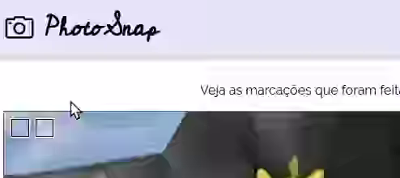
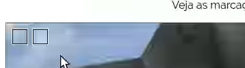
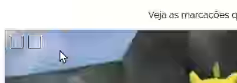
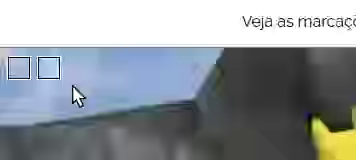
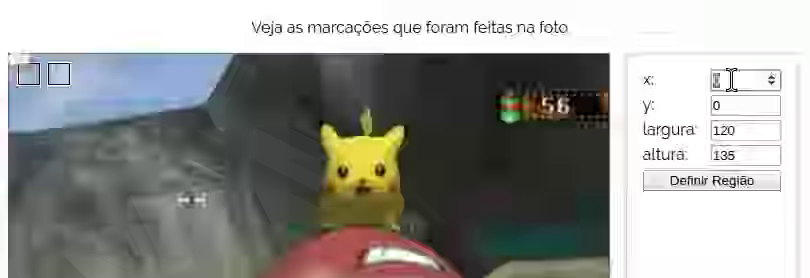

# P~~oké~~hotoSnap :camera: x2

Uma ferramenta para marcar suas fotos! Agora com **jQuery** =D


## Atividade

[Baixe os arquivos aqui][baixe-aqui]. Você deve modificar a página
para que ela mostre as marcações na imagem. Cada marcação é definida por
uma região retangular e possui um título e um conteúdo, que devem ser
exibidos em um balãozinho quando o usuário passar o mouse sobre cada uma.

### Exercício 0: Verificar funcionalidade pronta

Repare que existem dois arquivos JavaScript:

1. `script/balaozinho-vanilla.js`
1. `script/balaozinho-jquery.js`

O arquivo `index.html` está incluindo o `balaozinho-vanilla.js`, que contém
a atividade pronta, mas usando JavaScript puro (que chamamos de
_"vanilla JavaScript"_).

Abra a página no navegador e veja que o balãozinho está funcionando, assim
como o botão para "definir região" da primeira marcação.

Agora, altere o `index.html` para apontar para o `script/balaozinho-jquery.js`,
**que está vazio** - aí vai "parar de funcionar".

Além de trocar do `balaozinho-vanilla.js` para o `balaozinho-jquery.js`, você
deve incluir a biblioteca jQuery. Há duas formas de fazê-lo e, para lembrar,
veja nos slides [como incluir uma biblioteca][incluindo-biblioteca]. Você
vai precisar achar o site oficial da jQuery e ver as instruções lá. Na página
de _download_, pode haver várias versões da biblioteca. Prefira a mais recente,
e também, se tiver opção de versão comprimida/descomprimida, prefira a
comprimida (arquivo menor).

_Atenção_: o arquivo do jQuery deve ser **incluído ANTES** do
`balaozinho-jquery.js`, porque este último depende da biblioteca (logo,
deve vir depois).

### Exercício 1: Alterar/remover conteúdo do balãozinho



Em `script/balaozinho-jquery.js` (a) pegue uma referência às marcações
(`.marcacao`) e jogue para uma variável (_e.g._, com nome `$marcacoes`¹).
Faça o mesmo para o balãozinho (`#balaozinho`, com variável `$balaozinho`).

```js
// pegando 01 elemento: com vanilla JS vs com jQuery
let qtdePasteisEl = document.querySelector('#id-de-um-elemento');
let $qtdePasteis = $('#id-de-um-elemento');
```

```js
// pegando todos os elementos: com vanilla JS vs com jQuery
let paragrafosDestacados = document.querySelectorAll('.uma-classe');
let $paragrafosDestacados = $('.uma-classe');
```

Você deve atrelar os devidos eventos de mouse (veja slides sobre
[eventos em jQuery][eventos-jquery]) a cada `.marcacao` de forma que:

1. quando o **mouse entrar no quadradinho**, definir o conteúdo do
   `#balaozinho` como uma string qualquer
   - Para definir o conteúdo de um elemento HMTL (_i.e._, o `innerHTML`)
     usando jQuery, você deve usar o método `.html('<novo valor>')`
     (veja nos slides como [alterar o HTML em jQuery][jquery-alterar-html])
1. quando o **mouse sair do quadradinho**, definir o conteúdo como
   uma string vazia

```js
// atrelando eventos a múltiplos elementos: com vanilla JS
let paragrafos = document.querySelectorAll('p');
for (let paragrafoEl of paragrafos) {
  paragrafoEl.addEventListener('click', paragrafoClicado);
});

// com jQuery
$('p').click(paragrafoClicado);
```

¹**Nomenclatura de variáveis**: é uma boa convenção colocar o sufixo "El" no nome
de variáveis que apontam para elementos HTML (em _vanilla JS_). Contudo,
quando estamos usando jQuery, a convenção mais comum é **não usar o sufixo "El"
e colocar um prefixo "$"** para as variáveis. Exemplos:


### Exercício 2: ~~Formatação do balãozinho~~ (já está feito)



~~Estilize o `#balaozinho` para que ele se pareça com um balãozinho mesmo.
Sugestões:~~

- ~~Tamanho de fonte menor (tipo `10px`)~~
- ~~Cor de fundo semitransparente~~
- ~~Bordinha marota~~
- ~~Um espacinho interno (`padding`)~~
- ~~Cantinho levemente arredondado~~
- ~~Uma sombra sinistra (veja FAQ)~~

~~Além disso, faça com que o mouse fique com o `cursor` de `help` (mostra
uma interrogação em vez da setinha) quando em uma `.marcacao`.~~


### Exercício 3: Definir título/conteúdo correto do balãozinho



Agora, você deve substituir a "string qualquer" com um trecho HTML que
contenha o título e o conteúdo da marcação, tipo assim:

```html
<div id="balaozinho">  
  <h2>título da anotação</h2>
  <p>conteúdo da anotação</p>
</div>
```

Cada `.marcacao` é uma `<div></div>` devidamente estilizada e ela
está assim:

```html
<div class="marcacao"
  data-titulo="Electrode"
  data-conteudo="Este é uma pseudo-pokébola invertida"
  style="width: 20px; height: 20px; top: 10px; left: 40px;"></div>
```

Elas possuem dois atributos "personalizados": um deles chama
`data-titulo="..."` e armazena o título daquela marcação e o outro
chama `data-conteudo="..."` e armazena o texto que deve ir dentro do
parágrafo do balãozinho.

Na verdade, nós podemos usar atributos que não existem no HTML para
nossos próprios propósitos. Basta colocar `data-novoatributo` em um
elemento (_data_ em inglês = dados em português).

Para acessar o valor desses atributos em _vanilla JS_ usamos a
propriedade `dataset` do elemento HTML, assim:

```html
<span data-dikentinha="um texto">Algum assunto</span>
```
```js
let algumEl = document.querySelector('#um-id');
console.log(algumEl.dataset.dikentinha);
// imprime "um texto" no console
```

...contudo, em jQuery, usamos o método `.data('nome-do-atributo')`, assim:

```html
<span data-dikentinha="um texto">Algum assunto</span>
```
```js
let $algum = $('#um-id');
console.log($algum.data('dikentinha'));
// imprime "um texto" no console
```

Esse método `.data('nome-do-atributo')` não está nos slides, mas você pode
consultar a documentação da biblioteca:
https://api.jquery.com/data/#data2

### Exercício 4: Posicionamento do balãozinho



Faça com que, quando o mouse se movimente dentro de uma `.marcacao`
(_i.e._, evento `mousemove`), o `#balaozinho` se posicione nas mesmas
coordenadas que o mouse. Veja como [pegar a posição do mouse][posicao-mouse]
na documentação da biblioteca jQuery (veja os exemplos na página).


### Exercício 5: Definição da 1ª marcação



Faça com que o usuário possa definir as propriedades da 1ª marcação
(`left, top, width, height`) a partir dos campos `input` à direita.

Quando o botão for clicado, as propriedades da 1ª marcação devem ser
atualizadas.

Para pegar o valor de um `input`, fazemos assim:

```js
// em vanilla JS:
let largura = larguraEl.value;

// com jQuery:
let largura = $largura.val();
```

Para atualizar os valores de propriedades CSS em JavaScript usando jQuery,
você deve usar o método `.css('propriedade', 'novo-valor')`, conforme
[mostrado nos slides][jquery-css] e na
[documentação da biblioteca][jquery-css-api].

### Desafio 1: Atualização mais ágil da marcação

Em vez de usar o botão para atualizar as propriedades da marcação,
faça com que assim que o usuário pressionar uma tecla em qualquer dos
`input`s, a região da marcação seja atualizada. Aí você pode até tirar o
botão do HTML.

Isso pode ser feito com o evento `keyup` ou `input` que pode ser
associado as `input`s (usando jQuery, fica fácil fazer isso com todos
de uma só vez :).

### Desafio 2: Definição da marcação sendo editada

Faça com que, em vez de poder alterar apenas a 1ª marcação, o usuário
possa escolher qual delas quer atualizar.

Uma ideia é ter uma variável "global" que aponta para quem é a marcação atual.
Por exemplo:

```js
// inicialmente aponta para a primeira
let $marcacaoAtual = $($marcacoes[0]);
```
...e, quando uma marcação é clicada (evento `click`), você altera o valor
dessa variável para a devida `.marcacao`, usando `e.currentTarget`.

Por fim, na hora de atualizar a marcação, em vez de sempre pegar a primeira,
pega a `$marcacaoAtual` e altera suas propriedades CSS de acordo com o que
está nos `input`s.

### Desafio 3: Escolha da imagem (_hardcore!_ :bomb:)

Existe um `<input type="file">` que permite ao usuário escolher um arquivo
de seu computador. Você pode colocar um desses na página e, assim que o
usuário alterar valor desse `input` (evento `change`), seu código altera a
imagem que está sendo anotada.

Referência: https://www.html5rocks.com/en/tutorials/file/dndfiles/

## FAQ

### O que é jQuery?

É uma biblioteca JavaScript (ou seja, um arquivo `.js` reutilizável) criada em 2006 com o objetivo de agilizar a escrita de código JavaScript.

### Por quê usar o símbolo `$`?

JavaScript têm algumas regras para se dar nomes a variáveis. Por exemplo, não é possível que um nome comece com um dígito:

```js
let 3primeirosParagrafos = document.querySelectorAll('...');
// isto é inválido!!
```

Apesar da proibição dos dígitos no início do nome, os
símbolos `$` e `_` são válidos. John Resig, ao criar a
biblioteca, escolheu o `$` como o nome da variável global
que é uma função que expõe a funcionalidade da biblioteca
**por ser curto e um caractere válido**.

### O que é um **objeto jQuery**?

A função jQuery (ou função `$` - dólar) retorna algo que
chamamos de **objeto jQuery**, que parece com o que é retornado
por `document.querySelectorAll`, mas não é igual.

Por exemplo, se o `document.querySelectorAll` não encontra nenhum elemento,
ele retorna um _array_ vazio. A função `$` retorna um **objeto jQuery**,
que pode representar **apenas 01 elemento da página ou uma coleção deles**.

Isso é interessante porque podemos, por exemplo, atribuir um evento a
vários elementos de uma vez sem fazer um laço (_e.g._, um `for`):

```js
// em vanilla JS:
let paragrafos = document.querySelectorAll('p');
for (let paragrafoEl of paragrafos) {
  paragrafoEl.addEventListener('click', expandeOuRetraiParagrafo);
}

// com jQuery:
$('p').click(expandeOuRetraiParagrafo);
```

Outro caso de interesse é que, se o resultado da "busca no DOM" (_query_)
não tiver nenhum elemento, o **objeto jQuery** ainda assim possui os
métodos `.click`, `.mousemove`, `.css`, `.html` etc., que podem ser
chamados sem que erros aconteçam.

Diferentemente, se não estamos usando jQuery e o resultado de um
`document.querySelector('...')` não encontra nenhum elemento no DOM,
o resultado é `null` e invocar qualquer coisa de `null` vai dar erro.
Por exemplo:

```js
// em vanilla JS:
let logoEl = document.querySelector('#logomca'); // digitei o id errado
logoEl.addEventListener('click', tocaSom);       // dá erro!!!

// com jQuery:
$('#logomca').click(tocaSom); // não faz nada, mas tb não dá erro
```

### Por quê usar `$($marcacoes[0])` em vez de simplesmente `$marcacoes[0]`?

Quando acessamos o "i-ésimo" item de um **objeto jQuery**, o que é retornado
é um elemento HTML (_vanilla JS_) que representa esse elemento. Ou seja,
`$marcacoes[0]` não retorna um **objeto jQuery**, mas um elemento
HTML em _vanilla JS_.

Caso você queira chamar métodos jQuery nesse elemento, precisamos fazer
a consulta novamente, usando a biblioteca. Portanto, `$($marcacoes[0])`
retorna um objeto jQuery que representa a primeira marcação.

Alternativamente, em vez de usar `$($marcacoes[0])`, poderíamos usar
o [método jQuery chamado `.first()`][jquery-first], que retorna
o primeiro elemento de uma coleção. Portanto:

```js
let $primeiraMarcacao = $($marcacoes[0]);

// ...é equivalente a:
let $primeiraMarcacao = $marcacoes.first();
```

[baixe-aqui]: https://github.com/fegemo/cefet-front-end-snap/archive/jquery.zip
[posicao-mouse]: https://api.jquery.com/mousemove/#mousemove-handler
[incluindo-biblioteca]: https://fegemo.github.io/cefet-front-end/classes/js6/#incluindo-a-biblioteca-jquery
[eventos-jquery]: https://fegemo.github.io/cefet-front-end/classes/js6/#jquery-atribuindo-eventos
[jquery-alterar-html]: https://fegemo.github.io/cefet-front-end/classes/js6/#jquery-funcionamento-basico
[jquery-css]: https://fegemo.github.io/cefet-front-end/classes/js6/#jquery-estilizando-elementos
[jquery-css-api]: https://api.jquery.com/css/#css2
[jquery-first]: https://api.jquery.com/first/#first
