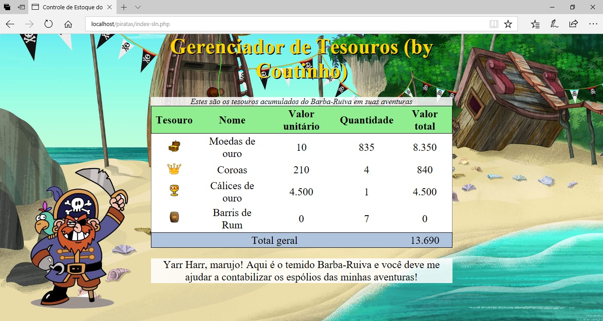
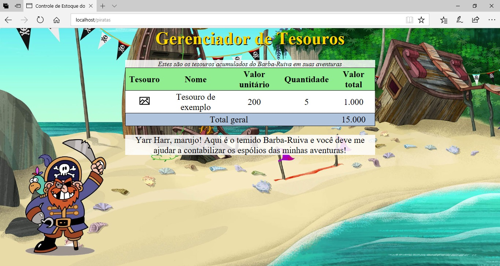
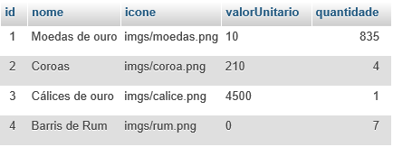

# Tesouros de Piratas Dinâmicos

Baixe aqui o [código seminal][seminal] desta atividade. Controlando o estoque de
tesouros de Barba-Ruiva x2, com Apache, PHP e MySQL. Este é o resultado final:



[seminal]: https://github.com/fegemo/cefet-front-end-pirates/archive/master-php.zip

## Atividade

Você deve alterar a página estática com os tesouros do temido Barba-Ruiva e
torná-la dinâmica, carregando os tesouros a partir de um banco de dados em vez
de simplesmente colocá-los no arquivo HTML.

Objetivos:
1. Introduzir o conceito de _back-ends_
1. Conhecer o Apache
1. Conhecer PHP
1. Conhecer o MySQL
1. Criar uma página dinâmica

### Exercício 1: usando Apache como um servidor estático

Primeiramente, **ative o WampServer** para que ele inicialize o servidor Apache
no seu computador. Siga o [tutorial][tutorial-wamp-decom] para fazer isso
nos computadores do laboratório do DECOM.

Após [baixar o código seminal][seminal] do trabalho, (a)
**descompacte-o** na área de trabalho, (b) **renomeie a pasta** para
`piratas`, (c) crie uma **pasta `piratas`** dentro do diretório `www` do
WampServer¹ e (d) **mova a pasta `piratas`** para dentro desse diretório
(do `www`).

Agora, (e) abra um navegador e **acesse `http://localhost/piratas/`²** para
ver a tradicional página dos tesouros do Barba-Ruiva.

Repare que não estamos usando PHP nem MySQL ainda. O Apache está simplesmente
servindo (_i.e._, entregando) os arquivos HTML, CSS, imagens etc sem fazer
nenhuma modificação neles.

Por fim, (f) **renomeie** o arquivo `index.html` **para `index.php`** e
acesse o site novamente (`http://localhost/piratas/`). O que mudou? Note que a extensão pode estar escondida: entre em `exibir`->`extensões do arquivo`. 

Visualmente, nada foi alterado. Mas, agora, o Apache varreu o arquivo
`index.php` em busca de _tags_ do PHP (_i.e._, as `<?php ... ?>`) para
executá-las antes de entregar o arquivo para o navegador. Como ainda não há
nenhuma _tag_ PHP, o resultado foi idêntico ao anterior. Ou seja, continuou
assim:




_¹: Normalmente o Wamp é instalado na pasta `C:\wamp64`. Logo, procure
pelo diretório `C:\wamp64\www\` e coloque a pasta `piratas` lá dentro._

_²: Se você não sabe o que significa `localhost` e tem curiosidade, leia
sobre isso no FAQ._

[tutorial-wamp-decom]: https://github.com/fegemo/cefet-front-end-pirates/raw/master-php/docs/usando-wamp-no-decom.pdf


### Exercício 2: escrevendomeuprimeirophp

Agora vamos escrever seu nome na página usando
[o comando `echo`][php-echo] do PHP. Dentro do título
`<h1>Gerenciador de Tesouros</h1>`, **coloque uma _tag_ PHP para escrever
seu nome**, de forma que fique assim:
`<h1>Gerenciador de Tesouros (by SEU NOME)</h1>`.

Uma _tag_ PHP é delimitada por `<?php ...código aqui... ?>`, que também pode ser
escrita assim: `<? ...código aqui... ?>` (sem o `php` na abertura).

O comando `echo` simplesmente escreve alguma coisa dentro do arquivo
HTML. Por exemplo:

```php
<h1>
  Olá! Seja bem vindo, <?php echo "Pirata"; ?>!
</h1>
```
...que, quando a página é preprocessada, se transforma em:
```html
<h1>
  Olá! Seja bem vindo, Pirata!
</h1>
```

É possível chamar o [`echo`][php-echo] **implicitamente** também, da seguinte
forma:

```php
<?="alguma coisa";?>
...que é o mesmo que:
<?php echo "alguma coisa"; ?>
```

Além de strings, é possível passar uma variável para o `echo`. Por
exemplo:

```php
<?php
  $meuNome = "Estegônisson Almeida";
  echo $meuNome;
?>
```

[php-echo]: http://php.net/manual/pt_BR/function.echo.php

### Exercício 3: criando o banco de dados dos tesouros e conectando a ele

Agora, você deve criar o banco de dados no MySQL para guardar os tesouros dos
piratas. Para isso, siga o
[tutorial de como acessar o phpMyAdmin][tutorial-phpmyadmin] e, depois, siga o
[tutorial para criar o banco de dados][tutorial-banco-de-dados] que vamos usar.
Use o nome `banco-dos-tesouros` para o banco de dados que está criando.

Use o arquivo `piratas.sql` que veio com o código seminal quando
o tutorial instruir você a carregar o _script_ que cria a tabela `tesouros`
no banco de dados `banco-dos-tesouros` que você está criando. Por curiosidade,
abra o arquivo `piratas.sql` usando um editor de texto (_e.g._, Notepad++)
e veja o que há dentro dele. Se ele fizer algum sentido pra você, você
pode até modificá-lo para, por exemplo, incluir mais alguns tesouros
(além dos 04 que estão lá).

Agora, altere o `index.php` para conectar com o banco de dados. Coloque
no topo do seu arquivo `index.php`, antes mesmo do `<!DOCTYPE html>`:

```php
<?php
  // faz a conexão com o banco de dados que criamos no MySQL usando o phpMyAdmin
  //                    endereço    usuario  senha   nome do banco
  $db = mysqli_connect("localhost", "root", "123456", "banco-dos-tesouros");
  $db->set_charset("utf8");

  // verifica se a conexão funcionou...
  if (!$db) {
    // encerra a execução do script php, mostrando um erro
    $descricaoErro = "Erro: não foi possível conectar ao banco de dados. ";
    $descricaoErro = $descricaoErro . "Detalhes: " . mysqli_connect_error();
    die($descricaoErro);
  }
?>
<!DOCTYPE html>
<html>
<head>
  ...
```

Recarregue a página e certifique-se de que ela continua idêntica. Se tiver
dado algum erro ao conectar ao banco de dados, ele será exibido no
navegador e deve ser corrigido (talvez a senha esteja errada, ou o nome
do banco que você criou seja outro, por exemplo).

[tutorial-phpmyadmin]: https://github.com/fegemo/cefet-front-end-pirates/raw/master-php/docs/abrindo-o-phpmyadmin-no-decom.pdf
[tutorial-banco-de-dados]: https://github.com/fegemo/cefet-front-end-pirates/raw/master-php/docs/criando-um-banco-de-dados-no-decom.pdf


### Exercício 4: lendo tesouros do banco de dados

Neste exercício você vai alterar o `index.php` para ler os tesouros do
banco de dados, em vez de deixá-los fixos na página.

Para isso, você deve escrever código PHP para (a) fazer uma **consulta na tabela
`tesouros` do banco de dados** para pegar todos os tesouros, colocando o
resultado em um _array_ (vetor) e, depois, (b) **percorrer o _array_**
e (c) colocar uma **linha da tabela HTML para cada tesouro no _array_**.

Para (a), logo antes de aparecer a `<table>` no `index.php`, coloque:
```php
  ...
  <?php
    // faz uma consulta no banco de dados para pegar todos os tesouros cadastrados
    $sql = "SELECT * FROM tesouros";
    $resultado = $db->query($sql);
  ?>
  <table>
    <caption>...</caption>
    <thead>
      ...
```

Agora, para (b), envolva a linha da tabela (`<tr>...</tr>`) que
coloca o "tesouro de exemplo" dentro de um `foreach` do PHP que vai percorrer
todos os tesouros que foram encontrados no banco de dados. O código ficará
assim:

```php
<table>
  ...
  <tbody>
    <?php
      // $resultado é o array que vamos percorrer
      // $tesouroAtual é a variável que contém o elemento atual do array
      foreach ($resultado as $tesouroAtual) {
    ?>
    <tr>
      ...
    </tr>
    <?php
      }
    ?>
  </tbody>
  ...
```

Neste momento, ao recarregar a página no navegador, ela deve mostrar o
"tesouro de exemplo" repetidamente 4 vezes (porque há 4 tesouros
no banco de dados).

Por fim, para (c), altere as linhas com o HTML do "tesouro de exemplo"
para escrever, no HTML, os dados referentes ao "tesouro atual"
(que está na variável `$tesouroAtual`). A cada iteração do _foreach_, a
variável `$tesouroAtual` representa uma linha da tabela do banco de dados
(ou seja, as informações sobre 01 tesouro).

No banco de dados, a tabela possui 5 colunas, das quais vamos precisar das
4 últimas:



Para pegar o valor de uma coluna, usamos a seguinte sintaxe:
`$tesouroAtual["nomeDaColuna"]`. Por exemplo, pra pegar o valor unitário
do tesouro e escrevê-lo no HTML:

```php
<?php echo $tesouroAtual["valorUnitario"] ?>
```
...ou, mais sucintamente:
```php
<?= $tesouroAtual["valorUnitario"] ?>
```

Há dois detalhes que requerem atenção:
1. Você deve colocar o nome do arquivo do ícone dentro do atributo `src`
   da `img`. **É válido** colocar uma _tag_ PHP dentro de um atributo,
   tipo assim:
   ```php
   ">
   ```
1. A última coluna (valor total do tesouro) não está armazenada no banco -
   porque ela é um cálculo: da quantidade vezes o valor unitário. Portanto, você
   deve multiplicar o valor que pegou da coluna `quantidade` e multiplicá-lo
   pelo valor que pegou da coluna `valorUnitario`.


Ao final dos exercícios, a página deve parecer com a seguinte imagem:


### Desafio 1: total geral dos tesouros

Agora você deve tornar dinâmico o cálculo do total geral dos tesouros - a soma
da última coluna de todos eles. Para isso, você deve criar uma variável
`$totalGeral` fora do _loop_ e, a cada iteração, acumular nela o total daquele
tesouro.

Ao final do `foreach`, essa variável terá o valor que é a soma dos
valores de todos os tesouros. Você deve escrevê-la no rodapé da tabela
(_i.e._, no `<tfoot>...</tfoot>`).


### Desafio 2: formatando números

É possível formatar os números (valor unitário, valor total e total geral)
para usar o separador de milhar e mostrar `8.135` em vez de `8135`, por exemplo.

Para tanto, existe a função [`number_format`][php-number_format], que
recebe 4 parâmetros e retorna o número passado no primeiro formatado
de acordo com a configuração dos outros 3 parâmetros.

Neste desafio, você deve ver a
[documentação do `number_format`][php-number_format] e alterar o código para
formatar a quantidade, o valor unitário, o valor total e o total geral
usando o separador de milhar com o caractere "." (ponto).

[php-number_format]: http://php.net/manual/pt_BR/function.number-format.php


## FAQ

FAQ é uma sigla para _Frequently Asked Questions_ que, em Português, traduz
em **Perguntas Feitas com Frequência**. A seguir, veja algumas questões que
podem surgir ao fazer este exercício, bem como as suas respostas.

### Por quê devo dar o nome de `index.php` ao meu arquivo?

Um arquivo `.php` é um arquivo HTML que é preprocessado pelo Apache em busca de
_tags_ da linguagem PHP, ou seja, as `<?php ... ?>` ou `<? ... ?>`.

Da mesma forma que o `index.html` se refere à página inicial de um
site estático, o `index.php` se refere à inicial de um dinâmico.


### O que é `localhost`?

Quando começamos a falar de redes de computadores (e a Internet é uma rede),
precisamos de uma forma para atribuir um endereço para cada computador
(assim como uma casa precisa de um endereço).

De fato, cada computador possui um endereço IP (_Internet Protocol_), que é
uma sequência de 4 números de 0 a 255 (na versão IPv4), tipo assim:
`200.120.0.1`.

Existe um endereço IP especial, que é o `127.0.0.1`, chamado endereço de
_loopback_ (ou de retorno). Ele representa o próprio computador que o
está acessando.

Logo, para acessar o Apache executando na nossa própria máquina, podemos abrir
o navegador e acessar: `http://127.0.0.1/` (teste aí, depois de ativar o Wamp).

Contudo, acessar um computador por seu IP não costuma ser uma boa ideia
(porque é mais fácil decorar um nome do que uma sequência de 4 números). Logo,
é possível dar nomes a endereços IP. De fato, por padrão, podemos acessar o
`127.0.0.1` usando o nome  `localhost`. Assim, acessar `http://127.0.0.1/` é
equivalente a acessar `http://localhost/` e esta última forma é mais usada que
a primeira.

Se você tiver curiosidade para saber como associar um nome a um endereço IP,
abra o **"arquivo _hosts_"** do computador:
- No Windows, ele costuma ficar em: `C:\windows\system32\drivers\etc\hosts`
  (abra-o com o notepad++, por exemplo)
- No Ubuntu: `/etc/hosts` (abra-o com o gedit, por exemplo)
